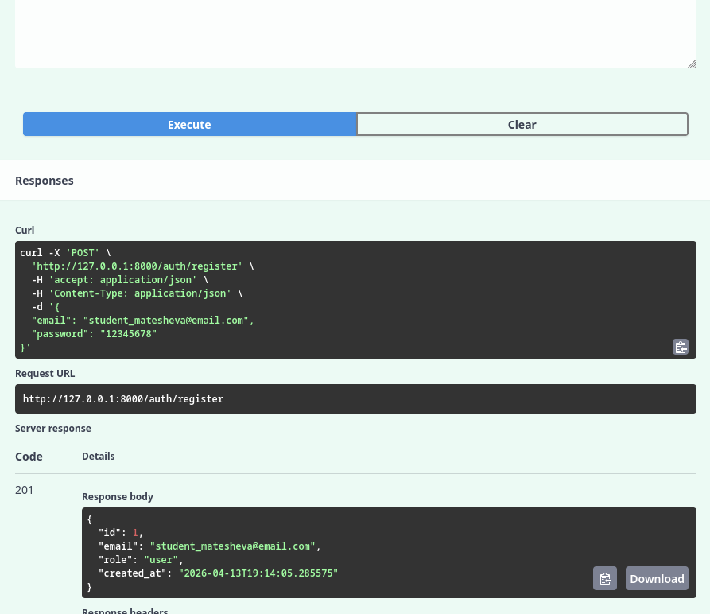
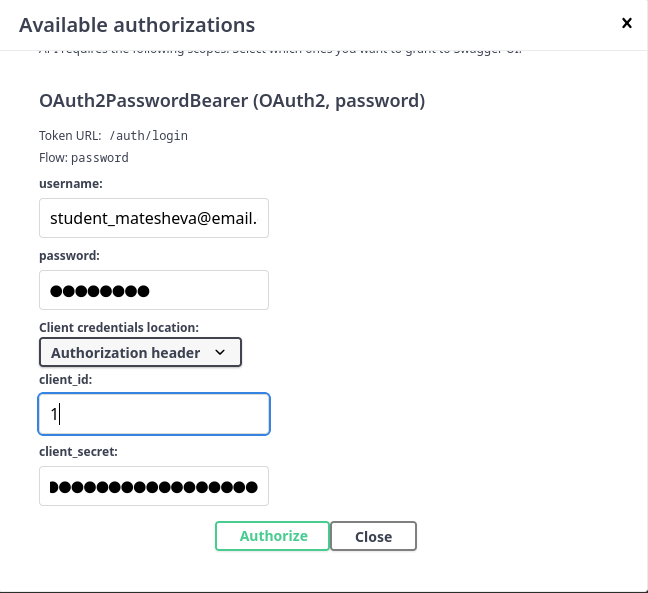
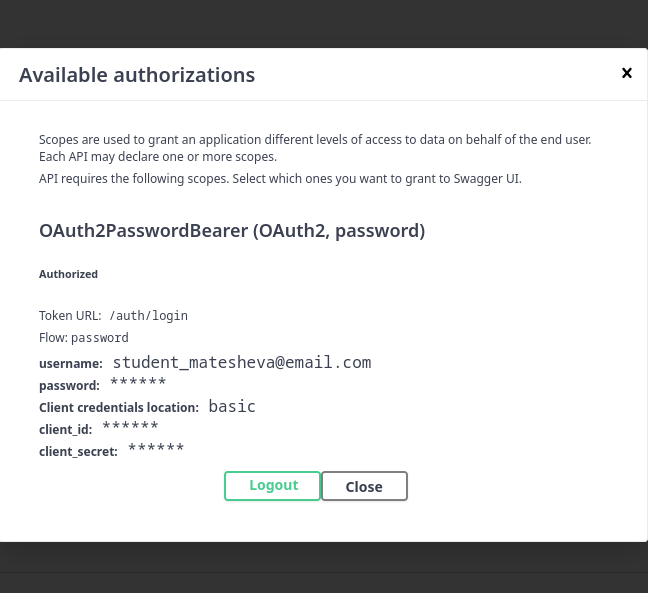
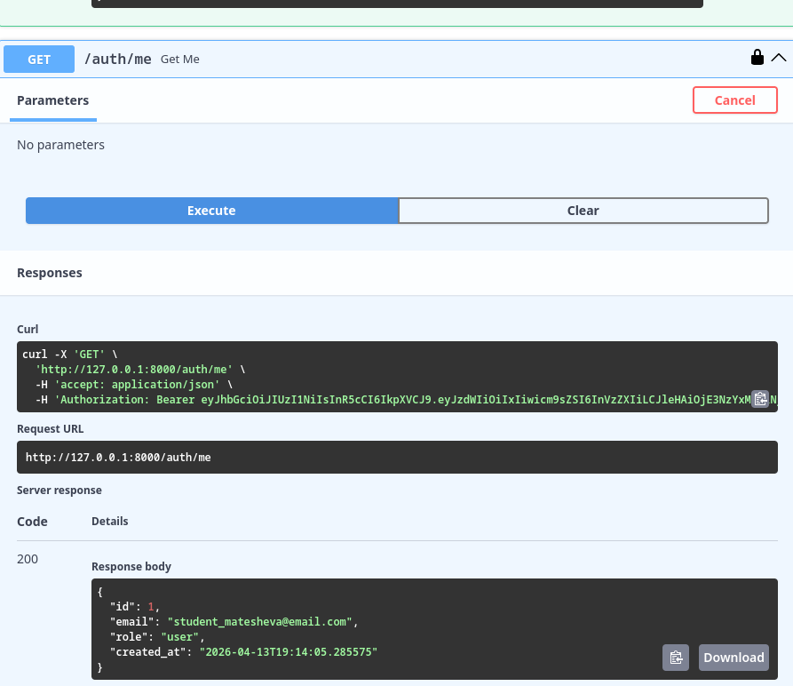
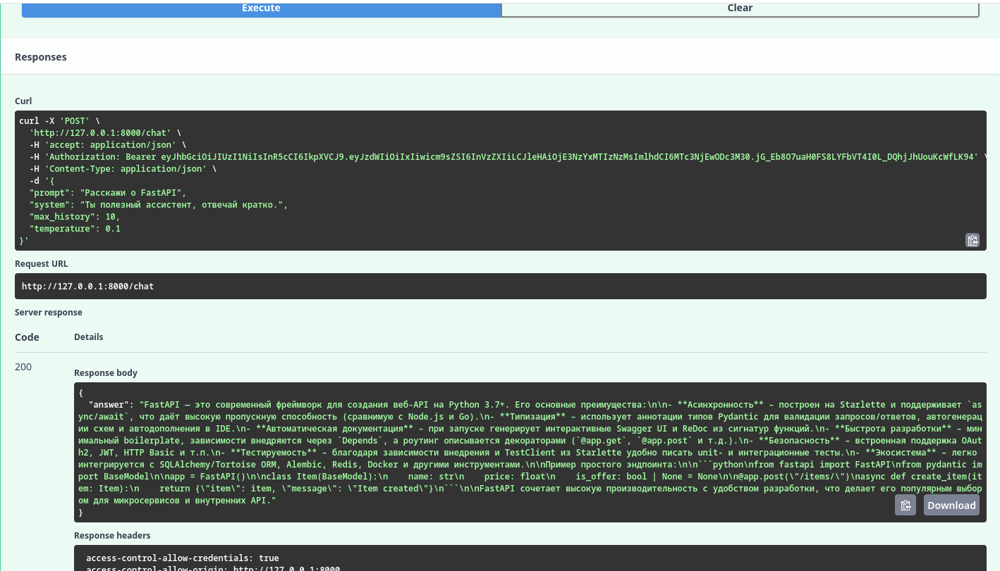
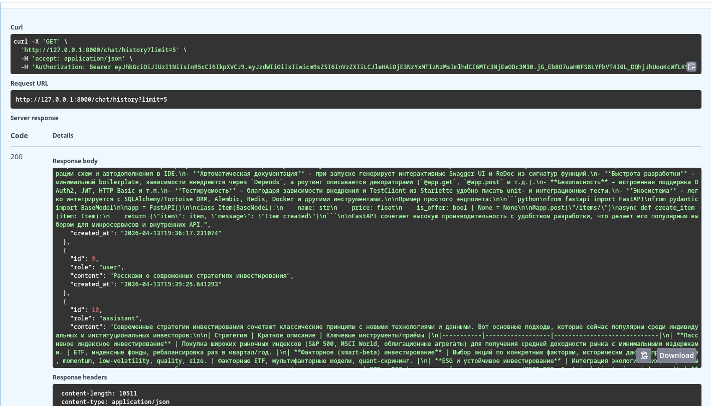
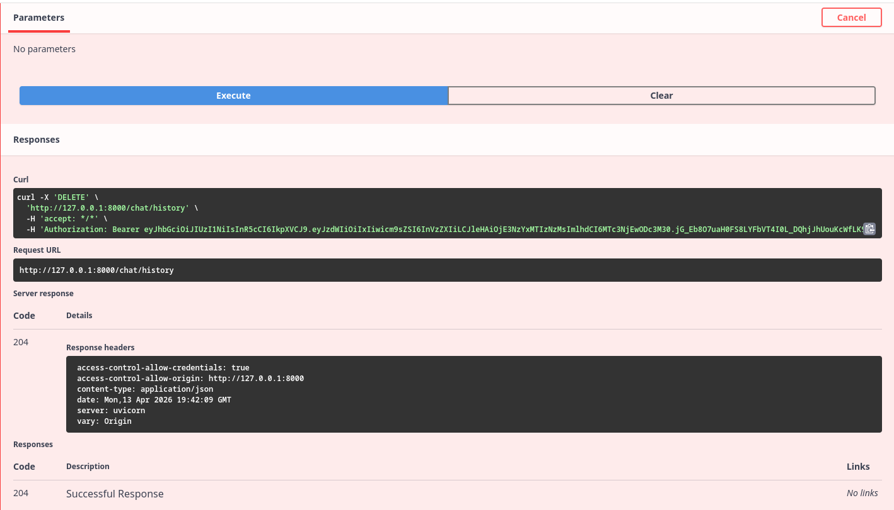

# llm-p — защищённое API для работы с LLM через OpenRouter

Серверное приложение на **FastAPI**, предоставляющее защищённый API для взаимодействия с большой языковой моделью (LLM) через сервис **OpenRouter**. Реализована аутентификация и авторизация с использованием **JWT**, хранение данных в **SQLite**, разделение на слои (API → UseCases → Repositories → DB / Services).

## Основные возможности

- Регистрация и аутентификация пользователей (JWT).
- Защищённые эндпоинты для общения с LLM (OpenRouter).
- Сохранение истории диалогов в базе данных.
- Просмотр и очистка истории чата.
- Автоматическая документация API (Swagger UI).

## Технологии

- **Python 3.11+**
- **FastAPI** — веб-фреймворк
- **SQLAlchemy** (async) + **aiosqlite** — работа с БД
- **Pydantic** / **Pydantic-Settings** — валидация и конфигурация
- **python-jose** — JWT
- **passlib[bcrypt]** — хеширование паролей
- **httpx** — асинхронные запросы к OpenRouter
- **uv** — управление зависимостями
- **ruff** — линтер

## Установка и запуск

### 1. Клонирование репозитория

```bash
git clone <url-репозитория>
cd llm-p
```

### 2. Установка uv (если не установлен)

```bash
pip install uv
```

### 3. Создание виртуального окружения

```bash
uv venv
```

Активация окружения:

- **Linux / macOS**:
  ```bash
  source .venv/bin/activate
  ```
- **Windows**:
  ```bash
  .venv\Scripts\activate
  ```

### 4. Установка зависимостей

Убедитесь, что файл `pyproject.toml` содержит все необходимые зависимости (см. раздел **Структура проекта**). Затем выполните:

```bash
uv pip install -r <(uv pip compile pyproject.toml)
```

### 5. Настройка переменных окружения

Скопируйте пример файла `.env` и отредактируйте его:

```bash
cp .env.example .env
```

Откройте `.env` и укажите:

- **OPENROUTER_API_KEY** — ваш API-ключ от [OpenRouter](https://openrouter.ai/).
- При необходимости измените **OPENROUTER_MODEL** на другую модель (по умолчанию `stepfun/step-3.5-flash:free`, но она может быть недоступна; рекомендуем `nvidia/nemotron-3-super-120b-a12b:free` или `openai/gpt-3.5-turbo`).

Пример `.env`:

```env
APP_NAME=llm-p
ENV=local

JWT_SECRET=your_super_secret_key_here
JWT_ALG=HS256
ACCESS_TOKEN_EXPIRE_MINUTES=60

SQLITE_PATH=./app.db

OPENROUTER_API_KEY=sk-or-v1-...
OPENROUTER_BASE_URL=https://openrouter.ai/api/v1
OPENROUTER_MODEL=nvidia/nemotron-3-super-120b-a12b:free
OPENROUTER_SITE_URL=https://example.com
OPENROUTER_APP_NAME=llm-fastapi-openrouter
```

### 6. Запуск приложения

```bash
uv run uvicorn app.main:app --reload --host 0.0.0.0 --port 8000
```

После запуска сервер будет доступен по адресу: **http://0.0.0.0:8000**

Документация Swagger UI: **http://0.0.0.0:8000/docs**

### 7. Проверка стиля кода (линтер)

```bash
ruff check
```

Ожидаемый вывод: `All checks passed!`

## Демонстрация работы

Ниже представлены скриншоты, демонстрирующие работу всех эндпоинтов. При регистрации используется email формата **student_*фамилия*@email.com**.

### 1. Регистрация пользователя



*Запрос на создание нового пользователя. В ответ возвращается публичная информация о пользователе (id, email, роль, дата создания).*

### 2. Логин и получение JWT


*Аутентификация через OAuth2 (form-data). В ответ приходит access_token.*

### 3. Авторизация через Swagger



*Нажатие кнопки Authorize в правом верхнем углу Swagger.*



*Ввод полученного токена в диалоговое окно.*

### 4. Проверка — получить свой профиль



*Защищённый эндпоинт `/auth/me` возвращает данные текущего пользователя.*

### 5. Общение с LLM



*Отправка запроса к OpenRouter через `/chat`. Модель генерирует ответ.*

### 6. Просмотр истории



*Эндпоинт `/chat/history` возвращает все сохранённые сообщения пользователя (включая запросы и ответы модели).*

### 7. Очистка истории



*Удаление всей истории диалогов через `DELETE /chat/history` (статус 204).*

### 8. Просмотр истории после очистки

.png)

*GET `/chat/history` после очистки возвращает пустой список.*

## Структура проекта

```
llm_p/
├── pyproject.toml              # Зависимости и метаданные
├── README.md                   # Документация
├── .env.example                # Пример переменных окружения
├── app/
│   ├── __init__.py
│   ├── main.py                 # Точка входа FastAPI
│   ├── core/                   # Конфигурация, безопасность, ошибки
│   │   ├── config.py
│   │   ├── security.py
│   │   └── errors.py
│   ├── db/                     # База данных (SQLAlchemy)
│   │   ├── base.py
│   │   ├── session.py
│   │   └── models.py
│   ├── schemas/                # Pydantic-схемы
│   │   ├── auth.py
│   │   ├── user.py
│   │   └── chat.py
│   ├── repositories/           # Слой доступа к данным
│   │   ├── users.py
│   │   └── chat_messages.py
│   ├── services/               # Внешние сервисы (OpenRouter)
│   │   └── openrouter_client.py
│   ├── usecases/               # Бизнес-логика
│   │   ├── auth.py
│   │   └── chat.py
│   └── api/                    # HTTP-эндпоинты
│       ├── deps.py
│       ├── routes_auth.py
│       └── routes_chat.py
└── app.db                      # Файл SQLite (создаётся автоматически)
```

## Проверка работоспособности

После запуска выполните следующие шаги:

1. **Регистрация**  
   `POST /auth/register` с email `student_*surname*@email.com` и паролем (мин. 8 символов).

2. **Логин**  
   `POST /auth/login` (form-data: username = email, password = пароль). Скопируйте `access_token`.

3. **Авторизация в Swagger**  
   Нажмите `Authorize` и вставьте токен.

4. **Запрос к LLM**  
   `POST /chat` с телом `{"prompt": "ВАШ ЗАПРОС"}`.

5. **История**  
   `GET /chat/history` — убедитесь, что сообщения сохранились.

6. **Очистка**  
   `DELETE /chat/history` — после этого история должна стать пустой.


## Возможные ошибки и их решение

| Ошибка | Причина | Решение |
|--------|---------|---------|
| `404 No endpoints found for ...` | Модель OpenRouter недоступна или указана неверно | Замените `OPENROUTER_MODEL` в `.env` на актуальную бесплатную модель (например, `nvidia/nemotron-3-super-120b-a12b:free`). Перезапустите сервер. |
| `429 Provider returned error` | Превышен лимит запросов к бесплатной модели | Подождите 1-2 минуты или используйте другую модель. Можно добавить свой API-ключ в настройках OpenRouter. |
| `401 Unauthorized` | Неверный или просроченный JWT | Получите новый токен через `/auth/login` и обновите авторизацию в Swagger. |
| `409 Conflict` | Email уже зарегистрирован | Используйте другой email. |
